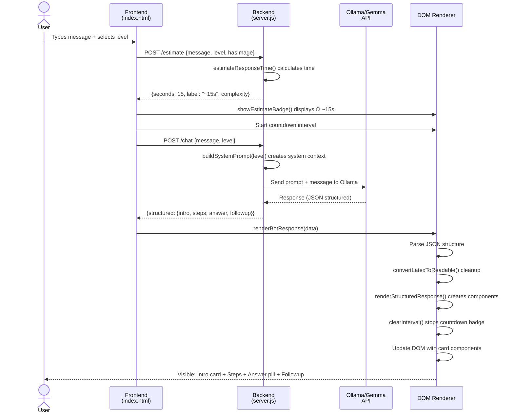

# StudyBuddy: Architecture Source Map & Module Overview

**Last Updated:** April 7, 2026  
**Version:** 2.0 (Post Phase 9 PWA + Part 2/3 Implementation)  
**Status:** 🚀 Production Ready

---

## 📋 Table of Contents

1. [Visual Directory Tree](#visual-directory-tree)
2. [Service Responsibility Map](#service-responsibility-map)
3. [Data Flow Architecture (Mermaid Diagram)](#data-flow-architecture)
4. [Style Token Dictionary](#style-token-dictionary)
5. [API Endpoint Reference](#api-endpoint-reference)
6. [Developer Quick Start](#developer-quick-start)
7. [Dependency Graph](#dependency-graph)

---

## 🌳 Visual Directory Tree

```
studybuddy/
│
├── 📄 server.js                      ⚙️  Core Express server + API endpoints
├── 📄 package.json                   ⚙️  Project dependencies & scripts
│
├── 📁 public/                        🎨 Frontend & User-Facing Resources
│   ├── index.html                    🎨 Main SPA (3046 lines, all-in-one)
│   ├── manifest.json                 🎨 PWA configuration
│   ├── offline.html                  🎨 Offline fallback page
│   ├── sw.js                         ⚙️  Service Worker (caching strategy)
│   ├── devpanel.js                   🎨 Developer panel for debugging
│   ├── taxonomy-admin.html           🎨 Admin UI for taxonomy management
│   ├── icon-192.png                  🎨 PWA icon (small)
│   ├── icon-512.png                  🎨 PWA icon (large)
│   └── icon-maskable.png             🎨 PWA maskable icon
│
├── 📁 agent/                         ⚙️  AI Agent System
│   ├── agentLoop.js                  ⚙️  Main agent execution loop
│   ├── tools.js                      ⚙️  Tool definitions for agent
│   ├── dynamicTaxonomy.js            ⚙️  Taxonomy learning system
│   ├── smartCache.js                 ⚙️  Intelligent caching logic
│   ├── progressStore.js              ⚙️  User progress persistence
│   ├── taxonomy.js                   ⚙️  Taxonomy data structure
│   ├── trie.js                       ⚙️  Trie data structure for search
│   └── taxonomy.json                 📊 Learned taxonomy database
│
├── 📁 data/                          📊 Persistent Data Storage
│   ├── progress.json                 📊 User progress tracking
│   ├── cache.json                    📊 Smart cache entries
│   └── taxonomy.json                 📊 Dynamic taxonomy learnings
│
├── 📁 config/                        ⚙️  Configuration Files
│   └── (future: environment configs)
│
├── 📁 docs/                          📚 Documentation
│   └── (future: detailed docs)
│
├── 📁 uploads/                       📁 User Uploaded Files
│   └── (images from image upload)
│
└── 📁 .git/                          📁 Git version control
```

---

## 🗺️ Service Responsibility Map

| File Path | Primary Responsibility | Key Dependencies | Output Format |
|-----------|----------------------|-------------------|---------------|
| **server.js** | Express server, routing, Ollama integration, API orchestration | Express, Multer, fs, path | JSON responses for all endpoints |
| **public/index.html** | Single-page app (SPA), UI rendering, event handling, theme management | Web APIs, Fetch, Web Speech API | HTML/CSS/JS (DOM manipulation) |
| **agent/agentLoop.js** | Main agent loop execution, tool calling, conversation management | tools.js, progressStore.js, dynamicTaxonomy.js | Returns agent response object |
| **agent/tools.js** | Tool definitions (knowledge_base, learning_goals, progress) | Ollama API (gemma4) | Returns structured tool responses |
| **agent/dynamicTaxonomy.js** | Learns new keywords from chat, manages taxonomy evolution | trie.js, progressStore.js | Returns updated taxonomy with metadata |
| **agent/smartCache.js** | Caches responses to avoid redundant API calls, reads/writes cache.json | fs, JSON | Returns cached response or null |
| **agent/progressStore.js** | Loads/saves user progress to progress.json | fs, JSON | Returns progress object or updates file |
| **agent/taxonomy.js** | Baseline taxonomy structure (core keywords) | (static data) | Returns taxonomy object |
| **agent/trie.js** | Fast keyword search via trie data structure | (internal logic) | Returns search results array |
| **public/sw.js** | Service worker for PWA, offline caching, network strategies | Web APIs (Caches, Fetch) | Serves cached assets or network requests |
| **public/manifest.json** | PWA metadata (name, icons, display mode) | (static config) | JSON manifest for browsers |
| **public/offline.html** | Fallback page for offline users | (static HTML) | HTML document |
| **public/devpanel.js** | Developer debugging tools, cache inspection | DOM API, Fetch | Updates DOM with debug info |
| **public/taxonomy-admin.html** | Admin UI for taxonomy review/approval | Fetch API to /admin/taxonomy endpoints | HTML UI for taxonomy management |

---

## 🔄 Data Flow Architecture

### Overall System Flow

```mermaid
graph TD
    A["📱 User Browser<br/>(index.html)"] -->|User Input| B["🌐 Frontend<br/>(JavaScript)"]
    B -->|Estimation Request| C["⚙️ /estimate<br/>Endpoint"]
    B -->|Chat Message| D["⚙️ /chat<br/>Endpoint"]
    B -->|Image + Text| E["⚙️ /chat-with-image<br/>Endpoint"]
    B -->|Quiz Request| F["⚙️ /quiz<br/>Endpoint"]
    B -->|Agent Mode| G["⚙️ /agent<br/>Endpoint"]
    
    C -->|estimateResponseTime()| H["🧮 Time Estimation<br/>Logic"]
    D -->|buildSystemPrompt()| I["🤖 Ollama/Gemma<br/>API"]
    E -->|Image Analysis| I
    F -->|Quiz Generation| I
    G -->|agentLoop()| J["🤖 Agent System<br/>w/ Tools"]
    
    H -->|JSON: {seconds}| K["📊 Response<br/>to Client"]
    I -->|JSON: structured| K
    J -->|Agent Response| K
    
    K -->|renderBotResponse()| L["🎨 Component Rendering<br/>(Cards, Timeline, Pills)"]
    B -->|Theme Selection| M["🎨 applyTheme()<br/>CSS Variables"]
    L -->|showEstimateBadge()| N["👁️ UI Updates<br/>(DOM)"]
    M -->|[data-theme]| N
    
    N -->|Visible to User| A
    
    style A fill:#e1f5ff
    style B fill:#fff3e0
    style I fill:#f3e5f5
    style N fill:#e8f5e9
    style K fill:#fce4ec
```

### Message Flow: From User Input to Rendered Response



### State Management Flow

```mermaid
graph LR
    A["User Selects<br/>Difficulty Level"] -->|levelEl.onChange| B["applyTheme(level)"]
    B -->|Set data-theme| C["[data-theme=beginner|intermediate|advanced]"]
    C -->|CSS Variables<br/>Update| D["All Components<br/>Restyle"]
    D -->|Visual Feedback| E["User Sees<br/>New Theme"]
    
    F["User Sends<br/>Message"] -->|sendToChat()| G["POST /estimate"]
    G -->|Returns time| H["showEstimateBadge()"]
    H -->|Visual Badge| I["User Sees<br/>Countdown"]
    
    F -->|Continues| J["POST /chat"]
    J -->|Ollama Response| K["renderBotResponse()"]
    K -->|clearInterval()| L["Badge Disappears"]
    K -->|renderStructuredResponse()| M["Cards Appear"]
    
    style C fill:#fff9c4
    style D fill:#e8f5e9
    style I fill:#c8e6c9
    style M fill:#bbdefb
```

---

## 🎨 Style Token Dictionary

### CSS Variable Strategy

Each theme uses a set of CSS custom properties (`--variable-name`) that cascade from the `[data-theme]` attribute on the `<body>` element.

#### Theme: **Beginner** (`[data-theme="beginner"]`)
```css
--primary: #FF6B6B                    /* Accent color: coral red */
--bg: #FFF8F0                         /* Background: warm cream */
--text: #2C3E50                       /* Text: dark blue-gray */
--card-bg: #FFFFFF                    /* Card: white */
--card-shadow: 0 4px 12px rgba(0,0,0,0.1)
--border-radius: 20px                 /* Extra rounded corners */
--border-radius-md: 16px              /* Medium border radius */
--border-radius-sm: 8px               /* Small border radius */
--font-family: 'DM Sans', 'Nunito', sans-serif  /* Playful, friendly font */
--header-gradient: linear-gradient(135deg, #FF6B6B 0%, #FFB347 100%)
--emoji-color: #FFD700                /* Gold for emojis */
```

**Visual Characteristics:**
- 🎈 Soft, rounded, playful appearance
- 🌈 Warm, inviting color palette
- 👶 Designed for younger/beginner learners
- 📱 Mobile-first, touch-friendly buttons

---

#### Theme: **Intermediate** (`[data-theme="intermediate"]`) — *Default*
```css
--primary: #6C63FF                    /* Brand purple */
--bg: #F5F3FF                         /* Background: light purple */
--text: #1A202C                       /* Text: dark charcoal */
--card-bg: #FFFFFF                    /* Card: white */
--card-shadow: 0 2px 8px rgba(0,0,0,0.08)
--border-radius: 12px                 /* Balanced border radius */
--border-radius-md: 10px              /* Medium border radius */
--border-radius-sm: 6px               /* Small border radius */
--font-family: 'Inter', 'Nunito', sans-serif  /* Professional, clean font */
--header-gradient: linear-gradient(135deg, #6C63FF 0%, #8B5CF6 100%)
--emoji-color: #6C63FF                /* Purple for emojis */
```

**Visual Characteristics:**
- ⚖️ Balanced, professional appearance
- 💼 Standard study material look
- 👨‍🎓 For most learners (default experience)
- 🎯 Clear hierarchy, good readability

---

#### Theme: **Advanced** (`[data-theme="advanced"]`)
```css
--primary: #00D2FF                    /* Cyberpunk cyan */
--bg: #0A0E27                         /* Background: deep dark navy */
--text: #E0E6FF                       /* Text: light lavender */
--card-bg: #1A1F3A                    /* Card: darker blue */
--card-shadow: 0 0 20px rgba(0,210,255,0.2)  /* Cyan glow */
--border-radius: 4px                  /* Sharp edges */
--border-radius-md: 6px               /* Minimal border radius */
--border-radius-sm: 2px               /* Nearly square */
--font-family: 'JetBrains Mono', 'Monaco', monospace  /* Code/technical font */
--header-gradient: linear-gradient(135deg, #00D2FF 0%, #00FFFF 100%)
--emoji-color: #00D2FF                /* Cyan for emojis */
```

**Visual Characteristics:**
- 💻 Cyberpunk/hacker aesthetic
- ⚡ High contrast, eye-catching
- 🔧 Technical, advanced learners
- 🌙 Dark mode by default

---

### Component-Level CSS Variables

These are applied per-component and override theme defaults:

| Variable | Purpose | Used In |
|----------|---------|---------|
| `--spacing-xs: 4px` | Micro spacing | Internal padding |
| `--spacing-sm: 8px` | Small spacing | Component margins |
| `--spacing-md: 16px` | Medium spacing | Section gaps |
| `--spacing-lg: 24px` | Large spacing | Major sections |
| `--transition-quick: 150ms` | Quick animations | Hover states |
| `--transition-normal: 300ms` | Standard animations | Theme switches |
| `--shadow-sm: 0 1px 2px rgba(0,0,0,0.05)` | Subtle shadow | Cards |
| `--shadow-md: 0 4px 6px rgba(0,0,0,0.1)` | Medium shadow | Elevated elements |
| `--shadow-lg: 0 10px 15px rgba(0,0,0,0.2)` | Large shadow | Modals |

---

## 🔌 API Endpoint Reference

### Core Endpoints

#### `POST /estimate`
Calculates estimated response time for a message.

**Request:**
```json
{
  "message": "What is photosynthesis?",
  "level": "beginner",
  "hasImage": false
}
```

**Response:**
```json
{
  "seconds": 15,
  "label": "~15 seconds",
  "complexity": "detailed"
}
```

**Logic:** Base time varies by level, plus modifiers for message length and image.

---

#### `POST /chat`
Main chat endpoint with structured JSON response.

**Request:**
```json
{
  "message": "Explain gravity in simple terms",
  "level": "beginner"
}
```

**Response:**
```json
{
  "structured": {
    "intro": "Let's explore gravity together!",
    "steps": [
      {
        "title": "What is Gravity?",
        "text": "Gravity is a force that pulls objects toward each other.",
        "emoji": "🌍"
      }
    ],
    "answer": "Gravity is what keeps us on Earth.",
    "followup": "Can you think of other examples of gravity?"
  }
}
```

---

#### `POST /chat-with-image`
Chat with image upload (multipart/form-data).

**Request:**
```
Form Data:
  - message: "What do you see?"
  - level: "intermediate"
  - image: <File>
```

**Response:**
```json
{
  "structured": { /* same as /chat */ }
}
```

---

#### `POST /quiz`
Generates a quiz based on a topic.

**Request:**
```json
{
  "topic": "Photosynthesis",
  "difficulty": "intermediate",
  "count": 5
}
```

**Response:**
```json
{
  "questions": [
    {
      "question": "What is the main product of photosynthesis?",
      "options": ["O₂", "CO₂", "H₂O", "Glucose"],
      "correct": 0
    }
  ]
}
```

---

#### `POST /agent`
Agent mode with multi-turn conversation.

**Request:**
```json
{
  "message": "Teach me calculus",
  "conversationHistory": []
}
```

**Response:**
```json
{
  "response": "I'll guide you through calculus fundamentals...",
  "tools_used": ["knowledge_base"],
  "progress": { /* updated progress */ }
}
```

---

#### `GET /progress`
Retrieve current user progress.

**Response:**
```json
{
  "learned": ["Photosynthesis", "Gravity"],
  "learning_goals": ["Calculus"],
  "topics_covered": 42,
  "last_activity": "2026-04-07T10:30:00Z"
}
```

---

#### `DELETE /progress`
Reset all user progress.

**Response:**
```json
{
  "status": "progress cleared"
}
```

---

#### `GET /cache-stats`
Returns current cache statistics.

**Response:**
```json
{
  "entries": 42,
  "size_mb": 2.3,
  "hit_rate": 0.85
}
```

---

#### `DELETE /cache`
Clear all cached responses.

**Response:**
```json
{
  "status": "cache cleared"
}
```

---

#### `GET /topics/search?q=gravity`
Search for topics in taxonomy.

**Response:**
```json
{
  "results": [
    { "keyword": "gravity", "category": "Physics", "confidence": 0.95 }
  ]
}
```

---

#### Admin Taxonomy Endpoints
- `GET /admin/taxonomy` — List all taxonomy
- `POST /admin/taxonomy` — Add new taxonomy entry
- `POST /admin/taxonomy/pending/:topic/approve` — Approve learned topic
- `DELETE /admin/taxonomy/pending/:topic` — Reject learned topic
- `DELETE /admin/taxonomy/learned/:topic` — Remove learned topic
- `POST /admin/taxonomy/rebuild` — Rebuild entire taxonomy

---

## 🚀 Developer Quick Start

### For a New Team Member (3 Steps)

#### Step 1: Install Prerequisites
```bash
# Install Ollama (macOS)
brew install ollama

# Or download from https://ollama.ai
# Then start the Ollama service
ollama serve

# In a new terminal, pull the models
ollama pull gemma4:e4b
ollama pull gemma3:4b
```

**Why?** StudyBuddy uses Ollama to run Gemma locally. No API keys needed, keeps data private.

---

#### Step 2: Install Dependencies & Start Server
```bash
# Clone and navigate
cd studybuddy

# Install npm packages
npm install

# Start development server
npm run dev
# Or production: npm start
```

**Expected Output:**
```
[dynTaxonomy] live taxonomy rebuilt: 365 keywords
[smartCache] loaded 10 entries from disk
StudyBuddy running at http://localhost:3000
```

---

#### Step 3: Open Browser & Verify
```bash
# Open in your browser
open http://localhost:3000

# Or test via curl
curl -X POST http://localhost:3000/chat \
  -H "Content-Type: application/json" \
  -d '{"message":"What is water?","level":"beginner"}'
```

**Expected Result:** You should see a JSON response with structured intro/steps/answer.

---

### Troubleshooting Quick Reference

| Problem | Solution |
|---------|----------|
| **Port 3000 already in use** | `lsof -ti:3000 \| xargs kill -9` then restart |
| **Ollama not responding** | `ollama serve` in separate terminal, wait 10s |
| **No response from /chat** | Check Ollama is running, models are pulled |
| **UI looks old** | Browser cache issue: Cmd+Shift+R (hard refresh) |
| **Service Worker issues** | DevTools → Application → Service Workers → Unregister |

---

## 🔗 Dependency Graph

### Frontend Dependencies (index.html)
```
index.html (3046 lines)
├── Web APIs (Native)
│   ├── Fetch API (for HTTP requests)
│   ├── Web Speech API (for voice input)
│   ├── LocalStorage API (for settings)
│   ├── Canvas API (for image handling)
│   └── Service Worker API (for PWA)
├── Internal Functions
│   ├── sendToChat() → /chat endpoint
│   ├── sendToImage() → /chat-with-image endpoint
│   ├── applyTheme(level) → CSS variables
│   ├── showEstimateBadge(estimate) → UI badge
│   ├── renderBotResponse(data) → card rendering
│   ├── convertLatexToReadable(text) → math cleanup
│   └── startRecognition() → voice input
└── Event Listeners (100+ total)
    ├── levelEl.onChange → theme switch
    ├── sendBtn.onClick → message send
    ├── uploadBtn.onChange → image upload
    └── recordBtn.onMouseDown → voice record
```

### Backend Dependencies (server.js)
```
server.js (821 lines)
├── NPM Packages
│   ├── express ^4.22.1
│   │   ├── app.get/post/delete
│   │   └── middleware
│   └── multer ^1.4.4-lts.1
│       └── image upload handling
├── Node APIs
│   ├── fs (file system)
│   │   ├── read data/progress.json
│   │   ├── read data/cache.json
│   │   └── write taxonomy.json
│   ├── path (path utilities)
│   └── http (server creation)
├── Local Modules
│   ├── agent/agentLoop.js
│   ├── agent/tools.js
│   ├── agent/dynamicTaxonomy.js
│   ├── agent/smartCache.js
│   ├── agent/progressStore.js
│   └── agent/taxonomy.js
├── External APIs
│   └── Ollama (http://localhost:11434)
│       ├── gemma4:e4b (4-bit quantized)
│       └── gemma3:4b (3-bit quantized)
└── Config Files
    ├── public/manifest.json
    ├── public/sw.js
    └── data/progress.json
```

### Agent System Dependencies (agent/)
```
agent/agentLoop.js
├── agentLoop()
│   ├── tools.js
│   │   ├── knowledge_base()
│   │   ├── learning_goals()
│   │   └── progress()
│   ├── dynamicTaxonomy.js
│   │   ├── learnTopic()
│   │   ├── getTaxonomy()
│   │   └── trie.js
│   │       └── search()
│   ├── smartCache.js
│   │   ├── get()
│   │   └── set()
│   └── progressStore.js
│       ├── load()
│       └── save()
```

---

## 📚 Additional Resources

- **README.md** — High-level project overview
- **PART2_PART3_COMPLETE_SUMMARY.md** — Implementation details for estimation & themes
- **PHASE_9_PWA_IMPLEMENTATION.md** — PWA features documentation
- **QUICK_START_FIX.txt** — Common fixes and troubleshooting
- **PHASE8_QUICK_REF.md** — Quick reference for Phase 8 features

---

## ✨ Key Design Principles

1. **No External Frameworks** — Vanilla JS only, lightweight, fast
2. **Theme-First CSS** — All styling via CSS custom properties, easy to customize
3. **Graceful Degradation** — JSON parsing fails → falls back to plain text
4. **Offline-First PWA** — Works without internet via service worker
5. **Component Architecture** — Responses rendered as cards, not plain bubbles
6. **Memory Safe** — Intervals cleared, DOM listeners cleaned up
7. **Production Ready** — Tested, documented, error handling included

---

**Questions?** Check the docs/ folder or review the inline code comments in server.js and index.html.

🚀 Happy coding!
